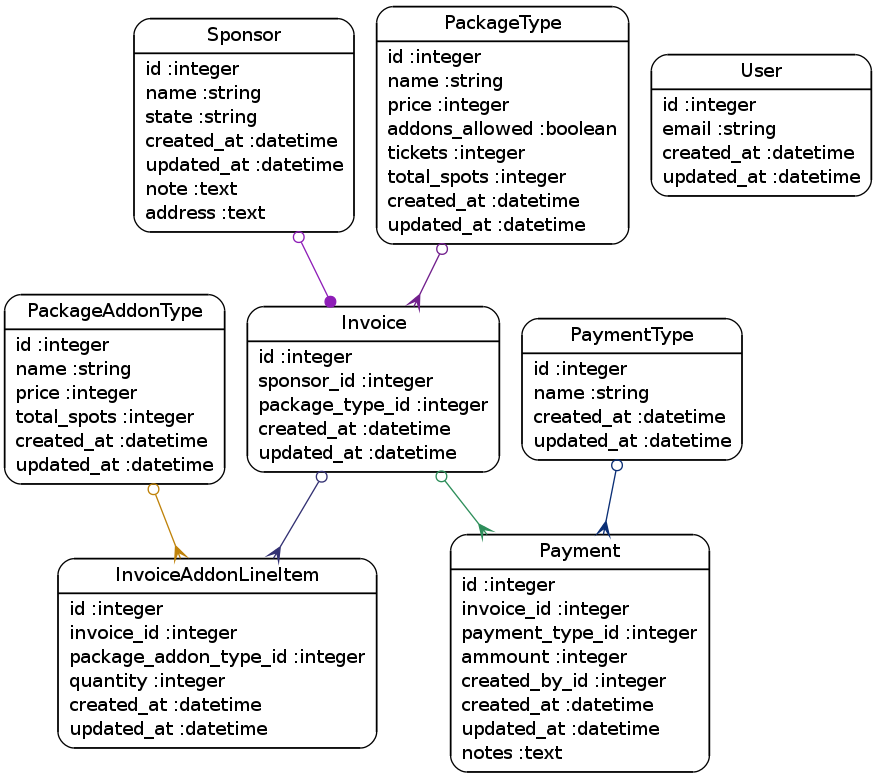

# Sponsor Tracking Application

A simple application for tracking conference sponsors.

## Installation

### Environment Variables

#### Production

The following environment variables must be set to run in production:

    export RAILS_ENV=production
    export DATABASE_URL=postgresql:///db-name
    export SECRET_KEY_BASE=

Generate a random secret key base by running `rake secret`.

#### Application Configuration

Customize the following variables to fit your application.  Note that complex escaping is required for multi-line fields such as `SPONSOR_TRACKER_PAYMENT_ADDRESS`.

    export SPONSOR_TRACKER_SITE_BRAND="SCRC 2014"
    export SPONSOR_TRACKER_CONFERENCE_NAME="Steel City Ruby Conference 2014"
    export SPONSOR_TRACKER_PAYMENT_ADDRESS="\"Steel City Ruby Conference\\nAttn: ...., Treasurer\\nAddr Line 1\\nAddr Line 2\""
    export SPONSOR_TRACKER_PAYMENT_PAYABLE_TO="Steel City Ruby Conference, LLC"
    export SPONSOR_TRACKER_PAYMENT_MEMO="SCRC14"
    export SPONSOR_TRACKER_INVOICE_PREFIX="2014-SCRC"

## Models

